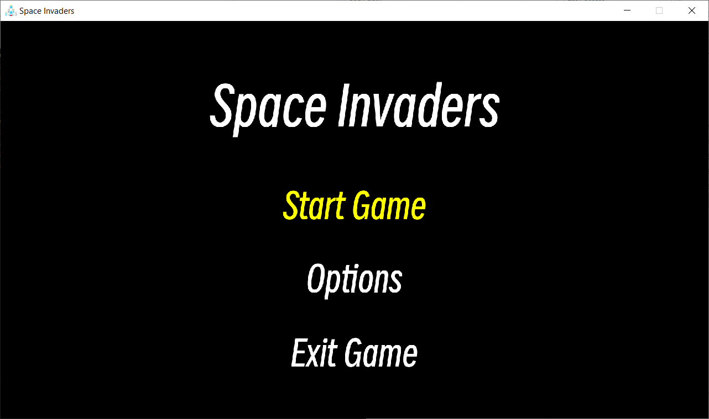
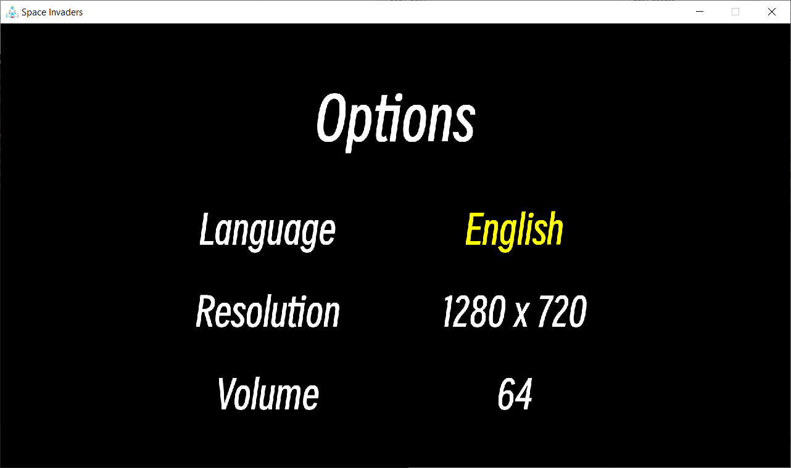

# :rocket: SpaceInvaders
A retro remake of the famous Space Invaders in C++ and SDL2. Developing a custom game engine as I am developing this game, and plan to use the game engine for an upcoming JRPG. 

## :video_game: Gameplay
The objective of Space Invaders is to destroy a fleet of aliens while avoiding their projectiles.

### Basic Controls
#### Keyboard
- AD - Horizontal movement
- Space - Shoot
- Up and Down Arrow - Navigate menu
- Enter - Confirm menu
- Left and Right Arrow - Change settings in options menu
- Escape - Return to main menu in game, restart game after game over

#### Controller
- Left joystick - Horizontal movement
- B - Shoot
- D-Pad Up and Down - Navigate menu
- B - confirm menu
- D-pad Left and Right - Change settings in options menu
- A - Return to main menu in game, restart game after game over

#### Supported features
- Chinese and English language
- Full Keyboard and controller support (only tested on Xbox controller)
- Multiple resolutions
- Save and Load for human readable settings.ini file
- Save and Load for game.ini file

## :framed_picture: Screenshots

## :computer: Getting Started
### Visual Studio

1. Clone the repository or download the source code files.
2. Open the Space Invaders project folder.
3. Use CMake to build the solution, all folders and libraries should be automatically added to the project.

## :books: Resources
- [How To Make A Game In C++ & SDL2 From Scratch! by Let's Make Games](https://youtube.com/playlist?list=PLhfAbcv9cehhkG7ZQK0nfIGJC_C-wSLrx)

## :raised_hands: Credits
- explosion6.mp3 by [messersm](https://opengameart.org/content/space-sound-effects)

- laser2.mp3 by [messersm](https://opengameart.org/content/space-sound-effects)

- Game.mp3 by [Matthew Pablo](https://opengameart.org/content/space-boss-battle-theme)

- Menu.mp3 by [Matthew Pablo](https://opengameart.org/content/space-dimensions-8bitretro-version)

- SmileySans-Oblique.ttf by [atelierAnchor](https://fontesk.com/smiley-sans-font/)

- Enemy1.png by [Clear Code](https://github.com/clear-code-projects/Space-invaders/tree/main)

## :page_facing_up: License
This project is licensed under the **MIT License**. Feel free to use and modify the code for personal or educational purposes.
